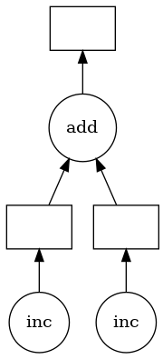
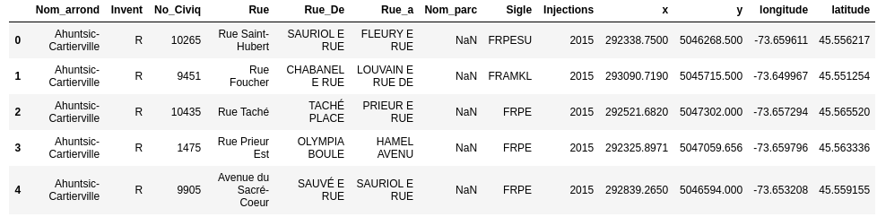
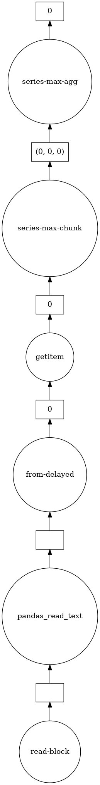

# Dask Введение
Цель этой лабораторной работы - дать вам краткое введение в функционирование Dask. Большинство примеров и материалов были взяты из [Учебник по Dask](https://github.com/dask/dask-tutorial).
## Dask delayed
Задержанные функции - это лениво оцениваемые функции (т.е. оцениваются только тогда, когда требуется результат / когда вызывается `compute ()`).
```python
from dask import delayed
```

Функции Python могут быть объявлены как обычно. Декоратор `@ delayed` может быть добавлен в функцию для указания функции с задержкой.
```python
def inc(x):
    return x + 1

@delayed
def add(x, y):
	return x + y
```

Или функцию можно передать в функцию `dask.delayed ()`
```python
x = delayed(inc)(1)
y = delayed(inc)(2)
z = add(x,y)
```

Поскольку `z` все еще является отложенным объектом, необходимо вызвать функцию` compute () `.
```python
z.compute()
```
```
5
```

Функция визуализации может использоваться для визуализации графика.
```python
z.visualize()
```


Все объекты Dask имеют атрибут `dask`, который хранит вычисления, необходимые для получения результата в словаре.

```python
dict(z.dask)
```
```
{'inc-badf625d-fc77-49c3-a3a8-520ebc7ce0d2': (<function __main__.inc(x)>, 1),
 'inc-cbe2d881-46da-49e4-8e12-9e2a756f4133': (<function __main__.inc(x)>, 2),
 'add-2d84e90c54d3a13bd4fff48a7cc67afd': (<function _operator.add(a, b, /)>,
                                          'inc-badf625d-fc77-49c3-a3a8-520ebc7ce0d2',
                                          'inc-cbe2d881-46da-49e4-8e12-9e2a756f4133')}
```

### Важные заметки
- Не все функции должны быть отложены. Может быть желательно немедленно выполнить быстрые функции, которые позволяют нам определить, какие медленные функции должны быть вызваны.
- Методы и доступ к атрибутам для объектов с задержкой работают автоматически, поэтому, если у вас есть объект с задержкой, вы можете выполнять обычные арифметические, срезы и вызовы методов для него, и он будет производить правильные отложенные вызовы.
```python
x = delayed(np.arange)(10)
y = (x + 1)[::2].sum()  # everything here was delayed
```

## Dask Bags
Dask-bag превосходна в обработке данных, которые могут быть представлены в виде последовательности
произвольные входы. Мы будем называть это «грязными» данными, потому что они могут содержать
сложные вложенные структуры, пропущенные поля, смеси типов данных и т. д.
функциональный стиль программирования очень хорошо вписывается в стандартную итерацию Python,
такие как можно найти в модуле itertools.

### Создание
Сумки Dask могут быть созданы из последовательности Python, файлов и т. Д.
```python
# each element is an integer
import dask.bag as db
b = db.from_sequence([1, 2, 3, 4, 5, 6, 7, 8, 9, 10], npartitions=2)
b.take(3)
```
```
(1, 2, 3)
```

### Манипуляция
Объекты Bag содержат стандартный функциональный API, который можно найти в таких проектах, как стандартная библиотека Python, toolz или pyspark, включая `map`,` filter`, `groupby` и т. Д.

Операции над объектами Bag создают новые сумки. Вызовите метод `compute ()` для запуска выполнения, как мы видели для отложенных объектов.
```python
def is_even(n):
    return n % 2 == 0

b = db.from_sequence([1, 2, 3, 4, 5, 6, 7, 8, 9, 10])
c = b.filter(is_even).map(lambda x: x ** 2)
c
```
```
dask.bag<map-lam..., npartitions=10>
```

```python
c.compute()
```
```
[4, 16, 36, 64, 100]
```

### Groupby and Foldby
Часто мы хотим сгруппировать данные по какой-либо функции или клавише. Мы можем сделать это либо с
метод `groupby`, который прост, но заставляет полностью перемешать
данные (дорогие) или с более сложным в использовании, но более быстрым методом `foldby`, который
делает потоковое объединение группового и редуцированного.

- `groupby`: перемешивает данные так, что все элементы с одним и тем же ключом находятся в одной паре ключ-значение.
- `foldby`: просмотр данных, накапливающих результат по каждому ключу.

Примечание: полный групповой бой особенно плох. В реальных рабочих нагрузках было бы неплохо использовать foldby или переключаться на DataFrames, если это возможно.

#### Groupby
Groupby собирает элементы в вашей коллекции, так что все элементы с одинаковым значением в какой-либо функции собираются вместе в пару ключ-значение.
```python
b = db.from_sequence(['Alice', 'Bob', 'Charlie', 'Dan', 'Edith', 'Frank'])
b.groupby(len).compute()  # names grouped by length
```
```
[(7, ['Charlie']), (3, ['Bob', 'Dan']), (5, ['Edith', 'Alice', 'Frank'])]
```

```python
b = db.from_sequence(list(range(10)))
is_even = lambda x: x % 2
b.groupby(is_even).starmap(lambda k, v: (k, max(v))).compute()
```
```
[(0, 8), (1, 9)]
[(0, 8), (1, 9)]
```
#### Foldby
При использовании foldby вы предоставляете:

- Ключевая функция для группировки элементов
- бинарный оператор, который вы передадите для сокращения, который вы используете для выполнения сокращения для каждой группы
- Объединить двоичный оператор, который может объединить результаты двух сокращенных вызовов в разных частях вашего набора данных.

Ваше сокращение должно быть ассоциативным. Это будет происходить параллельно в каждом из разделов вашего набора данных. Тогда все эти промежуточные результаты будут объединены двоичным оператором объединения.

```python
b.foldby(is_even, binop=max, combine=max).compute()
```
```
[(0, 8), (1, 9)]
```

#### Ограничения
Bags обеспечивают очень общие вычисления (любая функция Python). Эта общность достигается за счет затрат. Сумки имеют следующие известные ограничения

- Операции с пакетами, как правило, выполняются медленнее, чем вычисления в массиве / кадре данных, так же, как Python, как правило, медленнее, чем NumPy / Pandas.
- Bag.groupby работает медленно. Вы должны попытаться использовать Bag.foldby, если это возможно. Использование Bag.foldby требует больше размышлений. Еще лучше рассмотреть вопрос о создании нормализованного фрейма данных.

## Dask Arrays
Массив Dask предоставляет параллельный n-мерный массив с большим объемом памяти, используя заблокированные алгоритмы. Проще говоря: распределенный Numpy.

### Create dask.array object
Вы можете создать объект Array dask.array с помощью функции da.from_array. Эта функция принимает

- data: Любой объект, который поддерживает нарезку NumPy
- chunks: Размер куска, чтобы сказать нам, как заблокировать наш массив, например (1000000,)


```python
import dask.array as da
x = np.random.rand(100000000) # create random numpy array
y = da.from_array(x, chunks=(1000000,))
```

### Управляйте объектом dask.array, как массивом
Теперь, когда у нас есть массив, мы выполняем стандартные вычисления в стиле numpy, такие как арифметика, математика, срезы, сокращения и т. Д.

```python
result = y.sum()
result.compute()
```
```
49993551.54938029
```
```python
y[0:4].compute()
```
```
array([0.54890611, 0.84501265, 0.0433674 , 0.4306912 ])
```
### Ограничения
Dask.array не реализует весь интерфейс NumPy. Пользователи, ожидающие этого, будут разочарованы. В частности, dask.array имеет следующие недостатки:

- Dask не реализует все np.linalg. Это было сделано с помощью ряда отличных реализаций BLAS / LAPACK и является предметом многочисленных текущих научных исследований.
- Dask.array не поддерживает никаких операций, в которых результирующая фигура зависит от значений массива. Чтобы сформировать граф Даска, мы должны иметь возможность вывести форму массива до фактического выполнения операции. Это исключает такие операции, как индексация одного массива Dask другим или такие операции, как np.where.
- Dask.array не пытается выполнять такие операции, как сортировка, которые, как известно, трудно выполнять параллельно и которые имеют несколько меньшую ценность для очень больших данных (вам редко требуется полная сортировка). Часто мы включаем параллельные дружественные альтернативы, такие как `topk`.
- Разработка Dask основана на насущной необходимости, и так много менее используемых функций, таких как `np.full_like`, не были реализованы просто из-за лени. Это сделало бы отличный вклад сообщества.

## Dask Dataframes
Модуль dask.dataframe реализует заблокированный параллельный объект DataFrame, который имитирует большое подмножество Pandas DataFrame. Один Dask DataFrame состоит из множества панд данных в памяти, разделенных по индексу. Одна операция на Dask DataFrame запускает множество операций pandas на составляющих панелях DataFrames таким образом, чтобы учитывать потенциальный параллелизм и ограничения памяти.


```python
import dask.dataframe as dd

# Note: datatypes are inferred by reading the first couple of lines
# and may be incorrect and therefore need to be supplied
df = dd.read_csv('frenepublicinjection2015.csv',
dtype={"No_Civiq": str, "Nom_parc": str})
# load and count number of rows
df.head()
```


```python
# len is applied to each individual pandas dataframe
# and then the subtotals are combined by Dask
len(df)
```
```
21914
```
```python
df.latitude.max().visualize()
```



### Ограничения
Dask.dataframe охватывает только небольшую, но хорошо используемую часть API Pandas. Это ограничение по двум причинам:

- API Pandas огромен
- Некоторые операции действительно трудно выполнять параллельно (например, сортировать)

Кроме того, некоторые важные операции, такие как `set_index`, работают, но медленнее, чем в Pandas, потому что они включают в себя значительную перестановку данных и могут записывать на диск.
