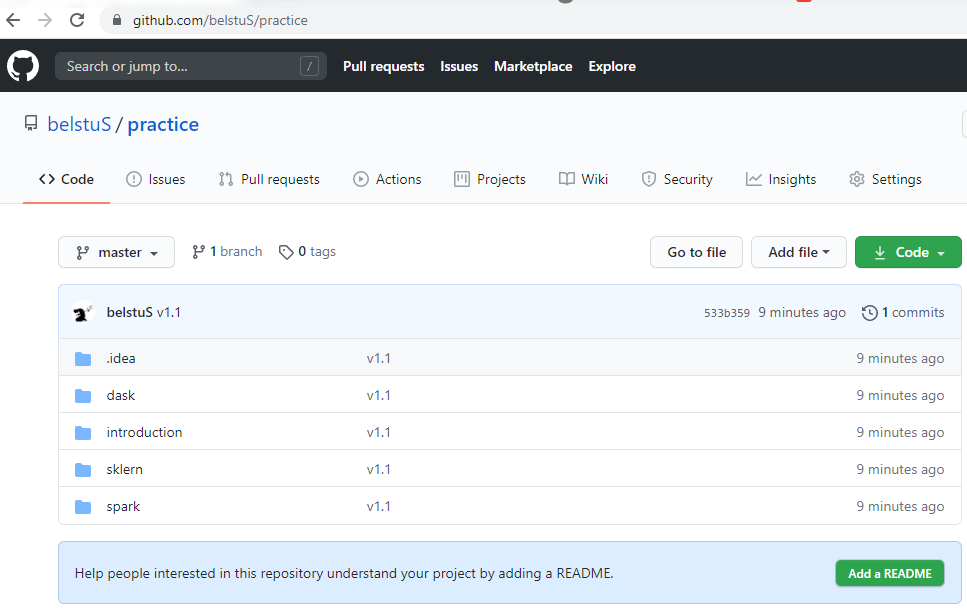

# Введение в большие данные
Цель этой презентации - представить инструменты, которые понадобятся вам в классе:- An overview of Git
- Аккаунт GitHub
- Обзор Python
- Обзор Pytest

## Шпаргалки
- [Git sheet](https://github.github.com/training-kit/downloads/github-git-cheat-sheet.pdf)
- [Pyspark sheet](https://s3.amazonaws.com/assets.datacamp.com/blog_assets/PySpark_Cheat_Sheet_Python.pdf)
- [Python sheet](https://perso.limsi.fr/pointal/_media/python:cours:mementopython3-english.pdf)
- [Another Python sheet](https://programmingwithmosh.com/python/python-3-cheat-sheet/)

## Git Введение
- [Git Guide](https://rogerdudler.github.io/git-guide)

Git является версионным программным обеспечением, таким как SVN или Mercurial. Есть несколько преимуществ использования git:
- Децентрализованные
- Бесплатный и открытый исходный код
- Популярный
- Сайт GitHub

### Рабочий процесс
#### В идеальном мире
- `git add <filename>` : Добавьте свое изменение в git.
- `git commit` :Подтвердите ваше изменение.
- `git commit --amend` : Исправить локальный коммит.
- `git push origin master` : Вставьте ваш локальный коммит в удаленный репозиторий.
- `git pull origin master` : Вытащить и объединить последний коммит из удаленного хранилища.

#### Bug Hunting
- `git log` : Список всех коммитов.
- `git checkout b793f5c257bc0b0a4d6728543cc36eaa2d6091c8` : Откат до выбранного коммита.
- `git checkout HEAD~1` :Откат к предыдущему коммиту.

### Создать учетную запись GitHub
Вы можете создать новую учетную запись GitHub [here](https://github.com/join).
### Получить репозиторий
Хранилище для этого проета находится [here](https://github.com/azazel7/BigData-Lab1)

#### Fork репоритория
Создайте копию исходного репозитория на вашем GitHub
учетная запись. Что позволит вам иметь полный контроль над хранилищем.
#### Клонировать хранилище
Клонирование git-репозитория загрузит всю историю репозитория на ваш компьютер.
- `git clone <url>`

## Python Введение
### Версия
- Python 3.5

### Почему Python
- Python очень популярен в науке и технике: проверьте [SciPy](https://scipy.org), [scikit-learn](http://scikit-learn.org).
- Python является свободным программным обеспечением 
- Python кросплатформенный язык, доступен для всех основных операционных систем
- Python - это универсальный язык, «второй лучший язык для всего»
- У Python есть активное онлайн-сообщество, [Stackoverflow](https://stackoverflow.com) и многие другие форумы

### Другие заметки
- Python является объектно-ориентированным языком
- Python - это интерпретируемый язык
- [Google](google.com) и [Stackoverflow](https://stackoverflow.com) твои лучшие друзья!

### Привет мир
```python
print("Hello world")
print('Hello world')
```
### Переменные
- Python динамически типизирован.
- В первом примере `otter` устанавливается как целое число, и его значение равно 3.
```python
otter = 3
```
Сразу после присвоения 3 `otter` вы можете передумать и назначить строку ...
```python
otter = "Otters will rule the world."
otter = 'Otters will rule the world.'
```
... или список.
```python
otter = ["Otters", "will", "rule", "Mars", "in", "2037"]
otter = [67, 51, 17, 101, 48]
```

Комплексные числа также работают:
```python
otter = 3 + 2j
```
### Основные операции
Python способен выполнять все основные операции.
```python
a = 10
b = 3
```
```python
a + b
Output: 13
a - b
Output: 7
a / b
Output: 3.33
a * b
Output: 30
a % b
Output: 1
```
### Контейнеры
#### Кортеж
Кортеж - это неизменный ряд переменных.
```python
parrot = (1, True, "otter")
print(parrot[1])
Output: True
```
Вы не можете изменить кортеж.
```python
parrot[2] = 7 #This won't work
parrot[2].append('a') #Works because a string act like a reference.
parrot[2] = parrot[2] + "platypus" # Won't work because your are reassigning the tuple
```

Примечание: RDD в Spark обычно работают с кортежами.
#### Списки
Список - это изменяемая серия переменных.
```python
turtle = ["whale", 1, True] #Создаем новый список с тремя значениями.
```
Вы можете переназначить значения и изменить список.
```python
turtle[0] = "fish" # Назначает строку «fish» первому элементу списка.
print(turtle)
["fish", 1, True]

turtle.append(72) # Добавим значение 72 в список.
print(turtle)
["fish", 1, True, 72]
```

#### Словари
Словарь - это изменяемая коллекция пар ключ-значение. Идея состоит в том, чтобы получить доступ
значения с индексами, состоящими из объектов, а не просто целых чисел.
```python
otter = {"names" : ["Mike", "Ali"],
		 4 : True, 
		 "animals" : 78}
```
Вы можете получить доступ к значению каждого индекса так:
```python
otter["names"]   # output ["Mike", "Ali"]
otter[4]     # output True
otter["animals"] # output 78
```

### Основные операторы

#### If/Elif/Then операторы

Код Python для условного выражения.
```python
otter = 10
if otter % 2 == 0:
	print(otter)
elif otter == 17:
	print("Otter equals 17")
else:
	print("Nothing much")
```

Теперь код в Java. Обратите внимание на важность отступа в Python.
```java
int otter = 10
if(otter%2 == 0){
	System.out.printf("%d", otter);
}
else if(otter == 17){
System.out.printf("Otter equals 17");
}
else{
		System.out.printf("Nothing much");
}
```
#### While оператор
```python
otter = 0
while otter % 10 != 9:
	print(otter)
	otter = otter + 1
```

Java-код:
```java
int otter = 10
while(otter % 10 != 9){
	System.out.printf("%d", otter);
	otter = otter + 1
}
```
#### For оператор
Идея оператора for заключается в переборе списка.
```python
for i in range(10):
	print(i)
```

Java-код показан ниже:
```java
for(int i = 0; i < 10; i = i+1){
	System.out.printf("%d", i);
}
```

Еще один пример с Python:
```python
otter = ["platypus", 78, {}, "42"]
for i in otter:
	print(i)
```
#### Контейнеры в одну линию
Для увелечния скорости, можно создавать списки и словари из цикла for.
```python
otter = [i*10 for i in range(10)]
whale = {i*10:i for i in range(10)}
```

#### Функции
Функции - это хороший способ разбить вашу программу на многократно используемые фрагменты кода.
```python
def turtle(p):
	return p * 3

turtle(3) # возвращаемое значение должно быть 9
```

Если это одноразовая функция, которая может быть записана в одну строку, вы можете определить функцию `lambda`:
```python
turtle = lambda p: p * 3
turtle(3) # the return value is 9
```

Обратите внимание, что если вы создаете лямбда-функцию, вы можете получить доступ к переменным вне области лямбда-выражения.

```python
otter = 4
turtle = lambda p: p * otter
turtle(3) # the return value is 12
```

### Модули
В какой-то момент нужно хранить отдельные файлы для разных типов функций.
Ключевое слово `import` позволяет python загружать файл python.

Как вызвать функцию косинуса из модуля `math`:
```python
import math
math.cos(3.14)
```

Импорт модуля и его переименование.
```python
import math as otter
otter.cos(3.14)
```

Импортировать конкретную функцию из модуля.
```python
from math import cos
cos(3.14)
```

Импортируйте конкретную функцию и переименуйте ее.
```python
from math import cos as otter
otter(3.14)
```

Обратите внимание, что ключевое слово import заставит python просмотреть все пути вашей переменной среды `PYTHONPATH`.
## Pytest
Pytest - это тестовый фреймворк, который облегчает написание простого модульного теста.
Вот быстрый пример. Предположим, что файл `test_sample.py` содержит
следующие строки:
```python
def incremente(x):
    return x + 1

def test_answer():
	assert incremente(3) == 4
```

Чтобы запустить тесты, просто запустите одну из следующих команд:
```python
pytest
pytest test_sample.py
```

Команда `pytest` проверяет файлы, начинающиеся с` test_`, и запускает функцию, когда их имена также начинаются с `test_`.